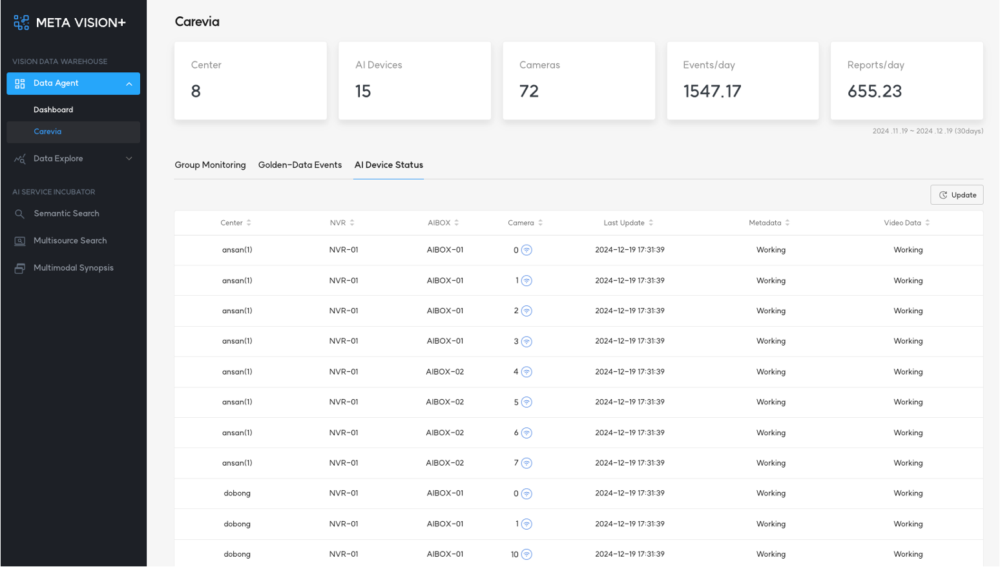

# 1. AI Device Status

<b>AI Device Status</b>는 <b>Data Agent</b>에서 원격으로 모니터링하는 장비의 상태를 체크하고, 현황을 보여줍니다.

상태 모니터링을 하고 있는 장비는 다음과 같습니다.

- 돌봄센터 서버
- NVR(Network Video Recorder)
- AI Box(Device)
- Camera

<b>< AI Device 상태 모니터링 ></b>

