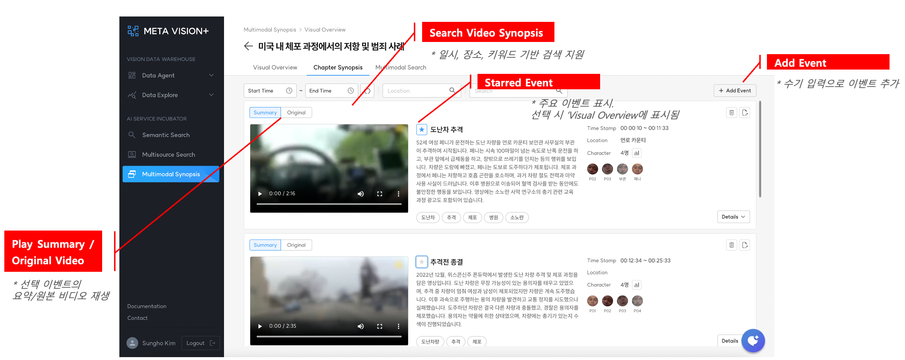
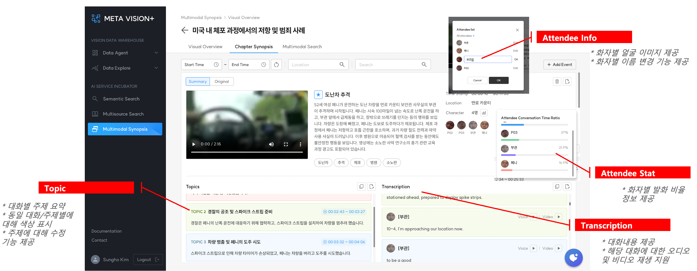

# Chapter Synopsis

비디오에서 추출된 모든 이벤트 목록 및 상세 정보(토픽 및 대화록) 제공

### 1. 주요 기능

- 이벤트별 요약, 일시, 장소, 화자(Atttendee) 정보 제공
- AI가 생성한 이벤트 정보에 대해 수정 및 삭제 기능 제공
- 수기 입력으로 신규 이벤트 생성 및 삭제 기능 제공

### 2. 이벤트 요약

- <b>Play Summary/Original Video:</b> 선택 이벤트의 요약/원본 비디오 재생
- <b>Search Video Synopsis:</b> 일시, 장소, 키워드 기반 검색 지원
- <b>Starred Event:</b> 주요 이벤트 표시. 선택 시 ‘Visual Overview에 표시됨
- <b>Add Event:</b> 수기 입력으로 이벤트 추가

 

<b>< Chapter Synopsis ></b>

### 3. 이벤트 상세 정보

- <b>Topic:</b> 대화별 주제 요약
    - 동일 대화/주제별에 대해 색상 표시
    - 주제에 대해 수정 기능 제공
- <b>Attendee Info:</b> 화자 정보 제공
    - 화자별 얼굴 이미지 제공
    - 화자별 이름 변경 기능 제공  
- <b>Attendee Stat:</b> 화자별 발화 비율 정보 제공
- <b>Transcription:</b> 시간순으로 대화내용 제공
    - 해당 대화에 대한 오디오 및 비디오 재생 지원

 

<b>< Chapter Synopsis Detail ></b>
