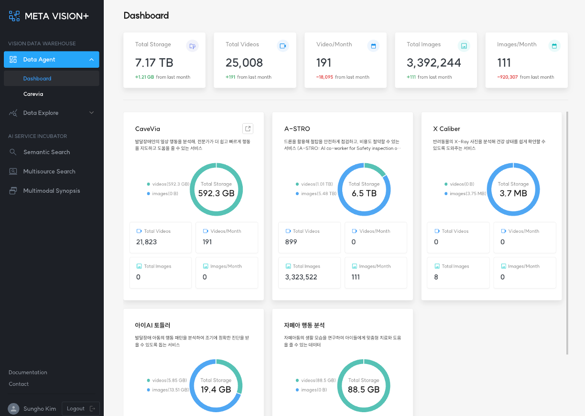

# Dashboard

<b>Dashboard</b>에서는 Data Agent에서 수집 및 관리하는 모든 서비스 데이터에 대한 현황 정보를 제공합니다.

제공하는 정보는 다음과 같습니다.

- 전체 데이터 보유 현황
    - Total Storage: 총 서비스 데이터 저장 사이즈
    - Total Videos: 누적 동영상 수
    - Videos/Month: 최근 한달동안 수집한 동영상 수
    - Total Images: 누적 이미지 수
    - Images/Month: 최근 한달동안 수집한 이미지 수

- 서비스별 데이터 통계 현황
    - Total Storage: 총 데이터 저장 사이즈
    - Total Videos: 누적 동영상 수
    - Videos/Month: 최근 한달동안 수집한 동영상 수
    - Total Images: 누적 이미지 수
    - Images/Month: 최근 한달동안 수집한 이미지 수

