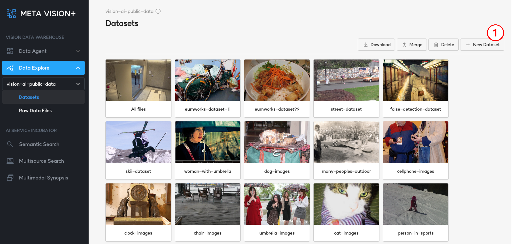

# 1. Datasets List

<b>Datasets</b>는 object storage에 있는 데이터에 대해 ML Workflow를 수행한 결과를 File browser 형태로 제공합니다.

<b>datasets</b>에는 기본 데이터셋('All files')이 제공되어 ML Workflow를 통해 추출된 파일 및 객체에 대한 메타 정보가 저장됩니다.

사용자는 기본 데이터셋 외에 데이터셋을 생성할 수 있으며, 검색 등을 이용하여 선택적으로 파일을 데이터셋에 추가할 수 있습니다.

<b>< 데이터셋 조회 ></b>

# 2. Add to Dataset

기본 데이터셋에서 또는 검색을 통해 확인한 파일 목록 중에서 선택적으로 원하는 파일을 데이터셋에 추가할 수 있습니다.

추가할 데이터셋은 기존 데이터셋에서 고를 수도 있고, 새로 생성하여 추가할 수도 있습니다.

<b>< 데이터셋에 파일 추가 ></b>

# 3. Detail View

데이터셋에 있는 파일을 선택하면 '상세 보기' 화면이 제공됩니다.

'상세 보기' 화면에서 제공되는 기능은 아래와 같습니다.

- 이미지 및 영상 재생
- 파일 다운로드
- 파일 삭제
- 메타데이터(파일 경로, 유형, 파일 사이즈, 파일 업로드 날짜 및 시간) 제공
- 데이터셋에 추가

<b>< 영상/이미지 상세 보기 ></b>

