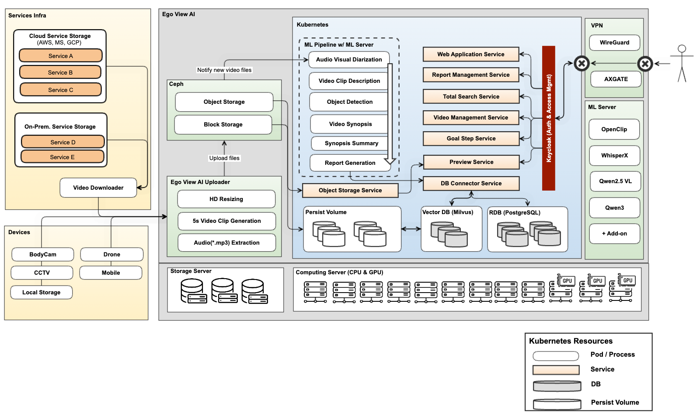

# 1. System Architecture

Meta Vision 인프라를 기반으로 하여, video 분석을 위한 여러 모델 및 ML Server를 구축하고 이를 연동하기 위한 ML Pipeline을 Apache Airflow를 활용하여 구축함

<b>< System Architecture of Ego View AI Service ></b>

# 2. Main Features & Models

## 1) 주요 기능 및 사용 모델
- 음성분석 및 화자 분리
    - [WhisperX](https://github.com/m-bain/whisperX?utm_source=chatgpt.com) 모델 사용
    - 비디오에서 오디오(*.mp3)를 추출하여, 화자별 대화기록을 추출
- 비디오 내용 분석
    - [Qwen2.5 VL](https://github.com/QwenLM/Qwen3-VL?utm_source=chatgpt.com)
    - 분석할 비디오를 5~30초 간격으로 클립 비디오를 생성하고, 이 단위로 비디오 요약을 추출
- 텍스트 요약 및 리포트 생성
    - [Qwen3](https://github.com/QwenLM/Qwen3?utm_source=chatgpt.com)
    - 대화기록, 비디오 요약 등의 내용을 요약하고, 타겟 서비스에 맞게 리포트 생성
- Semantic Search
    - [OpenClip](https://github.com/mlfoundations/open_clip?utm_source=chatgpt.com)
    - 비디오를 1fps 단위로 Image Embedding을 추출하여, 특정 장면 검색에 활용
- Object Detection
    - BBox Detector: YoloX Large 사용
    - Face Landmark Detector: Resnet50(Finetuned) 사용
    - License Plate Detector: YoloV8(Finetuned) 사용

## 2) ML Serving
- vLLM(Virtual Large Language Model Serving Framework)
    - 대규모 언어모델(LLM)을 고속·저비용으로 서빙하기 위한 프레임워크
    - [Architecture of vLLM](https://docs.vllm.ai/en/latest/design/arch_overview.html)
    - Qwen2.5 VL 및 Qwen3에 사용
- Nvidia Triton Server
    - Nvidia에서 제공하는, AI 모델을 GPU/CPU 환경에서 효율적·대규모로 서빙할 수 있도록 하는 범용 추론 서버
    - [Nvidia Triton Inference Server](https://github.com/triton-inference-server/server)
    - Object Detection에 사용
- Ray Serve
    - 분산형 AI 모델 서빙(Scalable Model Serving) 프레임워크
    - [Ray Project](https://github.com/ray-project/ray)
    - WhisperX에 사용

## 3) ML Workflow

### Sequence Diagram

<b>< ML Workflow of Ego View AI Service ></b>

### Apache Airflow

- 비디오 분석 워크플로우

 

- DAG별 Task Duration 모니터링

 