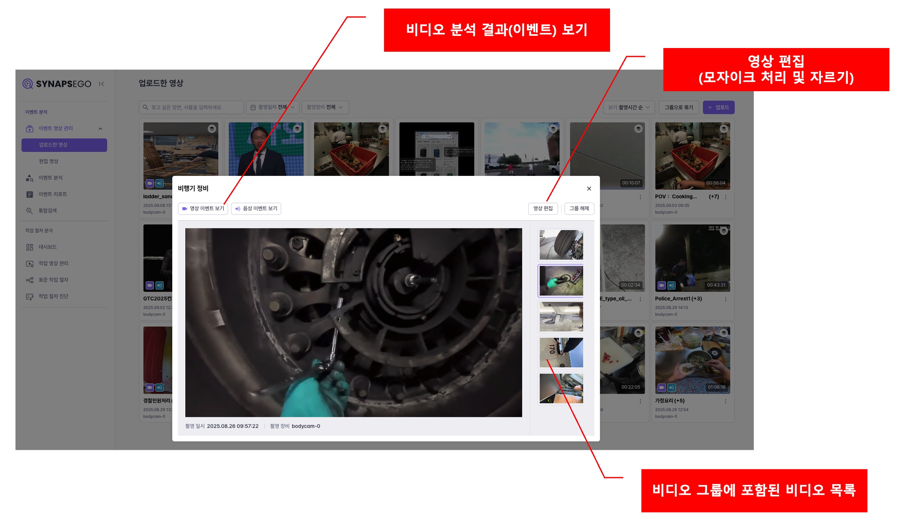
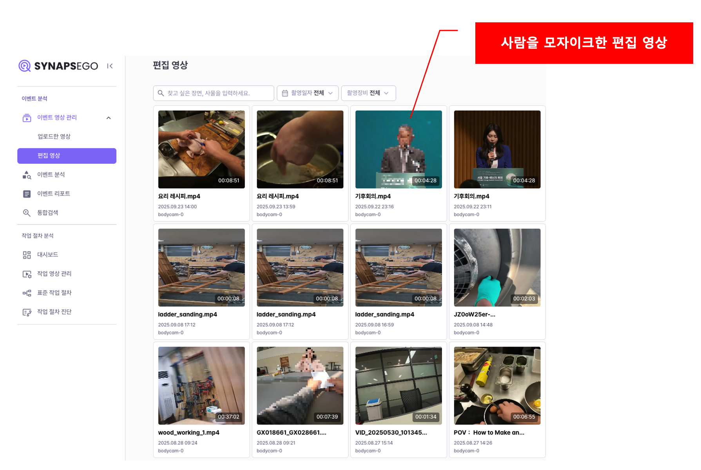
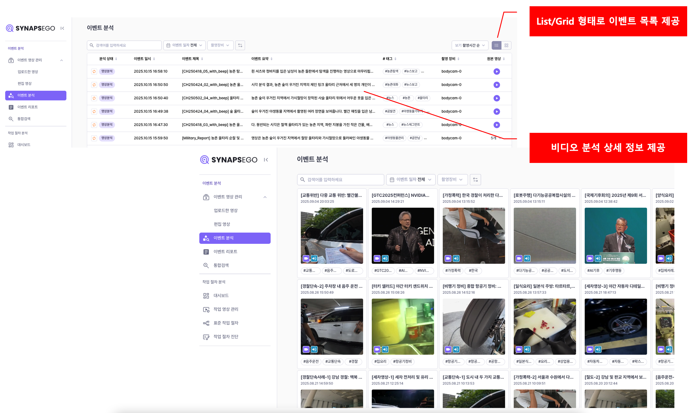

# Video Synopsis

수집된 비디오를 실시간으로 문석하고, 리포트 및 검색 서비스를 제공

## 1. 주요 기능
- <b>이벤트 영상 관리:</b> 수집된 비디오 및 비디오 그룹 목록을 제공하고, 편집 및 내보내기 기능 제공
- <b>이벤트 분석:</b> 비디오를 오디오 및 비디오 기반으로 분석하여, 주요 부분을 이벤트 영상으로 추출하고 요약 정보를 제공
- <b>이벤트 리포트:</b> 분석한 이벤트 중 선별하여 서비스 시나리오에 맞게 리포트를 생성
- <b>통합 검색:</b> 분석한 비디오의 주요 장면 묘사, 대화 기록, 이벤트 요약 및 리포트에 대해 검색 서비스 제공

## 2. 상세 기능 및 시나리오

### 1) 이벤트 영상 관리

#### A. 수집된 비디오 목록을 제공함
- 동일 사건 또는 기기로 묶인 여러 비디오를 한번에 분석하기 위해 비디오 그룹을 제공함
- 오디오/비디오 분석 유형 및 결과 표시

 

<b>< 수집된 비디오 목록 ></b>

#### B. 비디오별/비디오 그룹별 재생 화면 제공
- 선택 비디오의 분석결과 보기 기능 제공
- 비디오 편집 기능 제공

 

<b>< 비디오 재생 및 편집 ></b>

#### C. 비디오 편집 화면
- 특정 구간 자르기 및 모자이크(사람, 차량 번호판, 신분증) 옵션 제공

 

<b>< 비디오 편집 옵션 ></b>

 

<b>< 편집 영상 목록 ></b>

### 2) 이벤트 분석

#### A. 분석된 비디오 목록을 제공함
- 상세정보가 표시되는 리스트 형태와 썸네일이 제공되는 그리드 형태로 제공

 

<b>< 이벤트 목록 ></b>

#### B. 이벤트 상세 정보 제공
- 분석한 비디오에서 추출된 주요 이벤트 정보를 상세히 제공
- 제공 정보
    - 이벤트 클립 영상 재생
    - 비디오 전체 요약
    - 이벤트별 요약, 대화기록, 장소, 객체 정보(사람, 차량 번호판, 신분증 등)
    - 이벤트 내부 주요 장면에 대해 상세 요약 제공

 

<b>< 이벤트 상세 정보 ></b>

#### C. 이벤트 보관함
- 생성한 이벤트는 보관함에 저장하여 별도 관리할 수 있도록 함
- 이벤트 보관함에 있는 이벤트는 선별적으로 목적에 맞게 리포트를 생성하여 제공

 

<b>< 이벤트 보관함 ></b>

### 3) 이벤트 리포트

#### A. 발행한 리포트 목록을 제공함
- 상세정보가 표시되는 리스트 형태와 썸네일이 제공되는 그리드 형태로 제공

 

<b>< 발행한 리포트 목록 ></b>

#### B. 리포트 상세 정보 제공
- 선별한 이벤트로 생성한 리포트의 상세 정보 제공
- 제공 정보
    - 기본 정보(발생 일시/발생 장소/관련 인물) 제공
    - 선별한 이벤트 기반으로 리포트 생성(고객 요구사항에 맞게 형식 변경)
    - 사용된 이벤트의 영상 재생 및 대화 기록 제공

 

<b>< 리포트 상세 정보 ></b>

### 4) 통합 검색

- 영상에서 추출된 이벤트, 객체, 장면, 대화, 처리 절차, 리포트까지 주요 정보들을 자연어로 빠르게 검색

 

<b>< 통합 검색 초기 화면></b>

- 검색 결과는 영상, 이벤트, 주요 장면, 대화, 이벤트 리포트 등으로 분류하여 제공

 

<b>< 통합 검색 결과></b>

