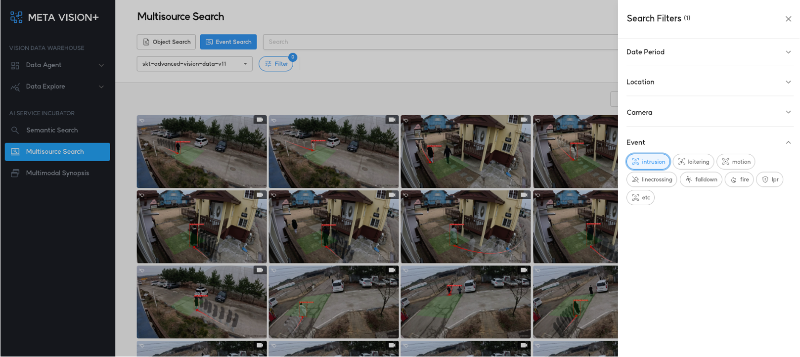
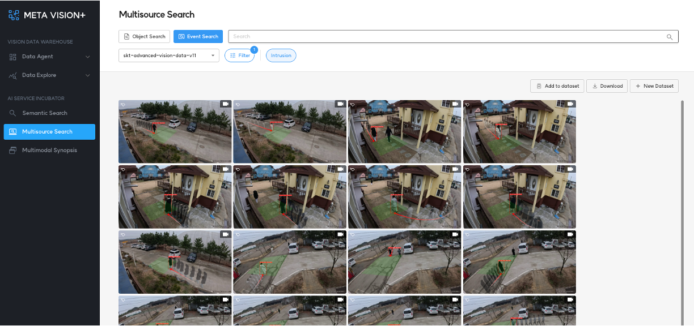
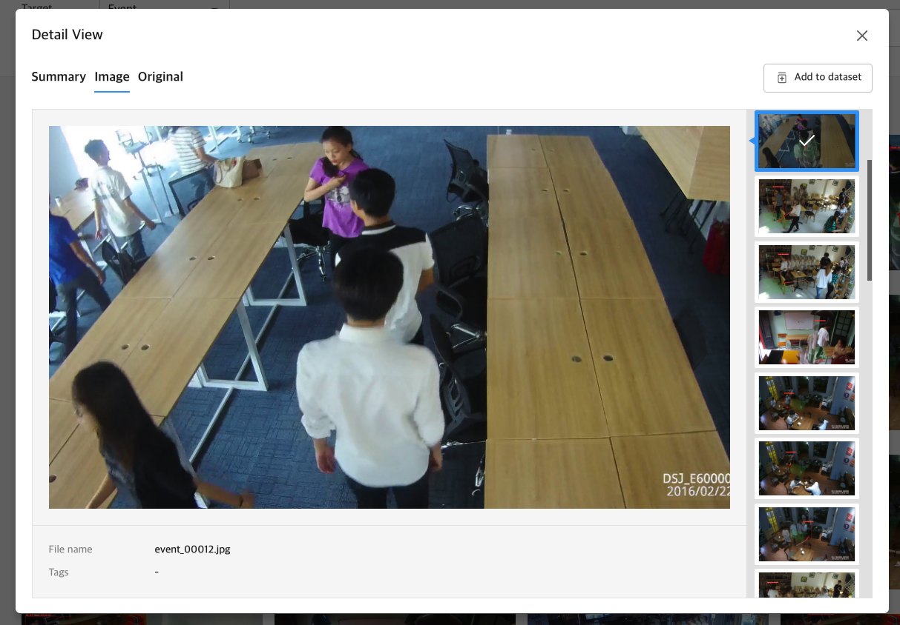

# 1. Event Search

<b>Event Search</b>는 AI가 인지한 행동 또는 이벤트를 검색할 수 있는 플랫폼입니다.

아울러 Semantic Search 기능을 제공하여 검색을 더욱 정교하게 할 수 있습니다.

검색 가능한 이벤트 종류는 다음과 같습니다.

- Intrusion
- Loitering
- Motion
- Line-crossing
- Fall-down
- Fire
- LPR(License Plate Recognition)
- Etc

<b>< Event Search 검색 옵션 ></b>

<b>< Event Search 검색 결과 ></b>

# 2. 검색 결과 상세 보기

검색 결과는 3 가지 형태로 제공됩니다.

- 이벤트에 대한 요약 영상

- 이벤트 발생 시점 이미지

- 이벤트 발생 시점 원본 영상

