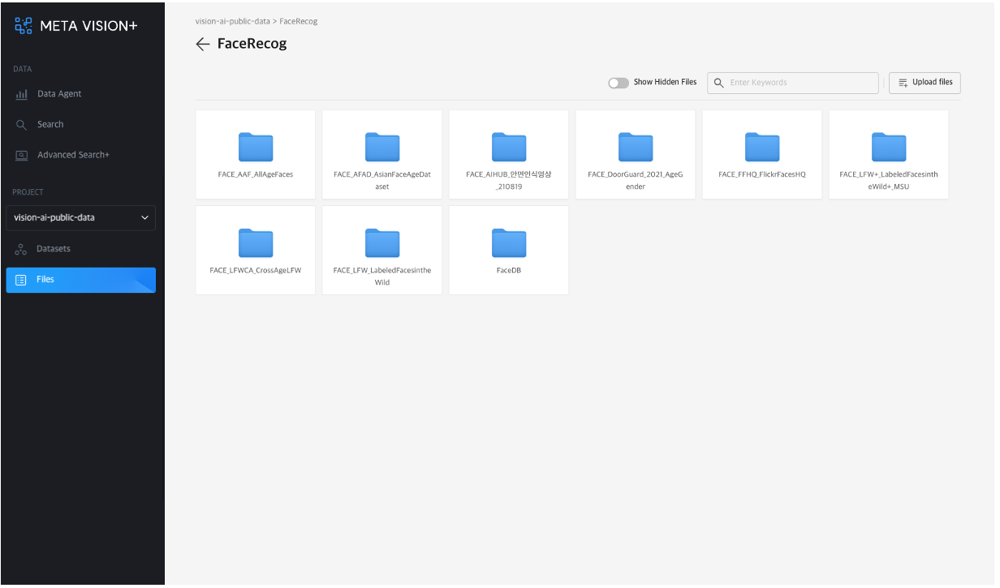
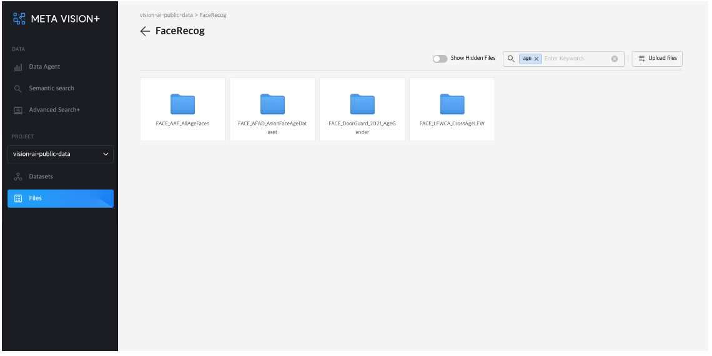
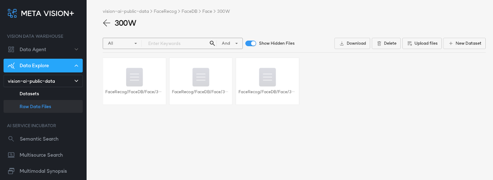

# 1. File Browser

<b>Files</b>는 Object Storage에 저장된 파일들을 File browser 형태로 볼 수 있도록 환경을 제공합니다. 

Object storage는 구조화되지 않은 대량의 데이터를 처리하도록 설계된 Data Storage Architecture입니다. 

Object Storage의 파일들은 파일 자체와 메타 정보를 가지고 있는 객체(object) 형태로 관리되고 있으며, 수평 확장이 가능하여 확장성에 제한이 거의 없어 대용량의 데이터를 저장하고 메타 정보를 활용하여 쉽게 검색 및 활용할 수 있습니다.

사진과 동영상 파일의 경우, 미리보기를 제공하고 있어 실시간으로 데이터를 확인할 수 있습니다.

<b>< 디렉토리 및 파일 목록 조회 ></b>

# 2. File Search

우측 상단의 검색 창을 통해 특정 디렉토리나 파일을 검색할 수 있습니다.

<b>< 디렉토리 및 파일 검색 ></b>

# 3. Show Hidden Files

MetaVision은 기본적으로 영상 또는 이미지 파일을 관리하고 제공합니다.

영상이나 이미지가 아닌 파일들을 조회하고 다운로드하려면 우측 상단의 'Show Hidden Files' 버튼을 활성화하면 됩니다.

<b>< 영상이나 이미지가 아닌 파일 조회 ></b>

# 4. Detail View

<b>Files</b>에서 제공된 목록을 선택하면 '상세 보기' 화면이 제공됩니다.

'상세 보기' 화면에서 제공되는 기능은 아래와 같습니다.

- 이미지 및 영상 재생
- 파일 다운로드
- 파일 삭제
- 메타데이터(파일 경로, 유형, 파일 사이즈, 파일 업로드 날짜 및 시간) 제공

<b>< 영상/이미지 상세 보기 ></b>
