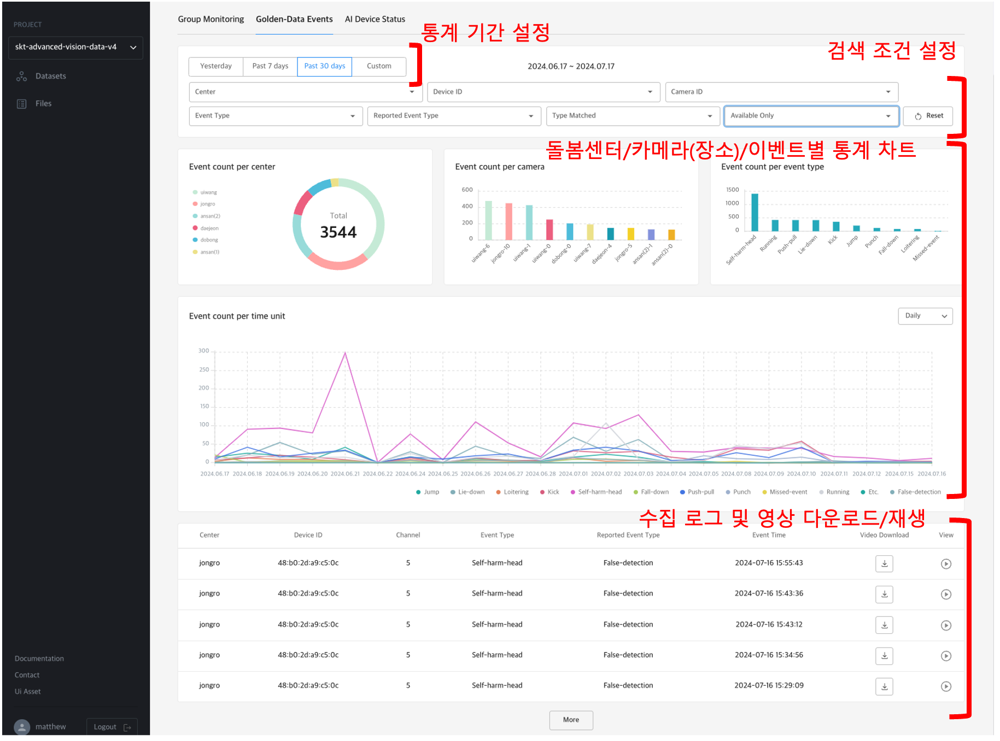
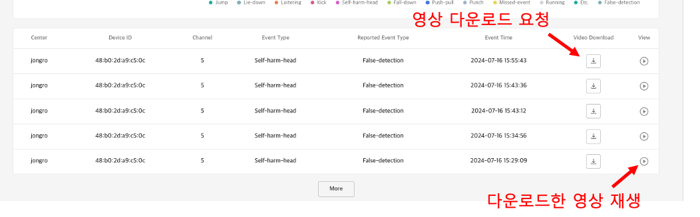
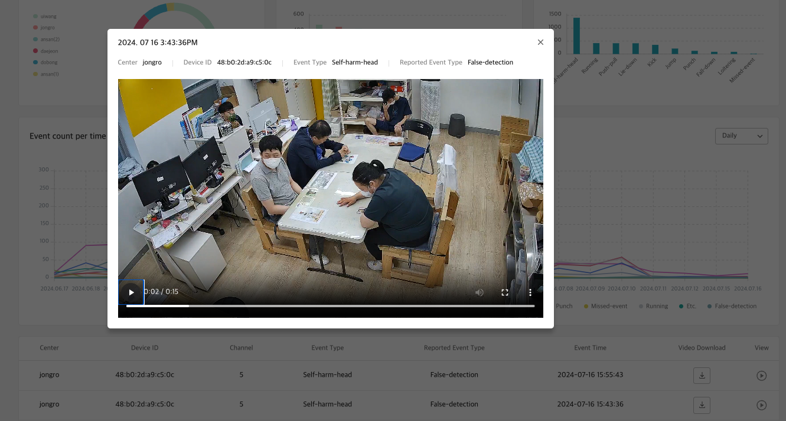

# 1. Golden-Data Events

<b>Golden-Data Events</b>는 <b>돌봄센터</b>에서 수집한 메타데이터와 영상 중 AI 개발에 필요한 부분을 쉽게 찾기 위해 통계 차트와 이벤트 목록을 제공합니다.

데이터 조회에 사용되는 조건은 다음과 같습니다.

- 돌봄센터
- AI Box(Device)
- Camera(설치 장소)
- AI가 인지한 이벤트
- 사람이 확인한 실제 이벤트
- AI 이벤트의 정답 여부
- 영상 다운로드 여부

<b>< Golden-Data Events 목록 및 통계 차트 ></b>

# 2. Video Download

<b>Data Agent</b>의 메타데이터로부터 사전에 정의한 규칙에 의해 영상을 자동 다운로드할 수 있습니다.

아울러 로그를 확인 후 사용자가 직접 다운로드 요청을 할 수가 있으며, 다운로드 후에는 바로 재생하여 해당 영상을 확인할 수 있습니다.

<b>< 이벤트 영상 다운로드 및 재생 ></b>
