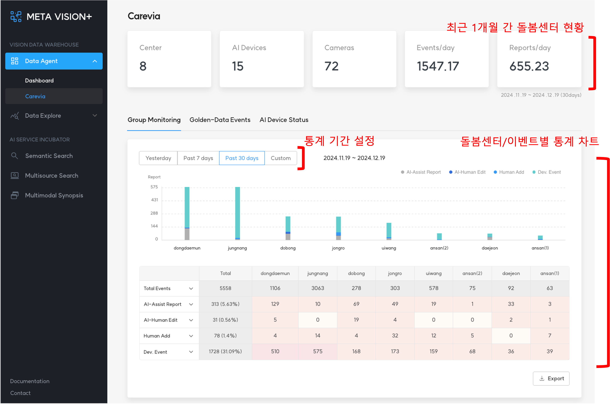
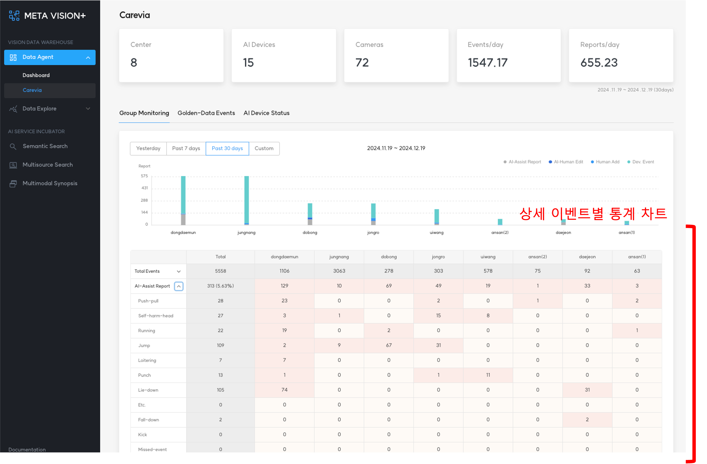

# 1. Group Monitoring

<b>Group Monitoring</b>에서는 돌봄센터별, 발생한 이벤트별로 통계 데이터를 제공합니다.

제공하는 기능 다음과 같습니다.

- 최근 1개월 간 돌봄센터 현황
- 통계 기간
    - 일별, 주별, 월별 설정 가능
- 돌봄센터/이벤트별 수집 통계
    - Total Events: AI가 인지한 전체 이벤트
    - AI-Assist Add: AI가 인지한 이벤트가 맞은 경우
    - AI-Human Edit: AI가 인지한 이벤트가 틀린 경우
    - Human Add: 이벤트가 발생하였으나 AI가 놓친 경우
    - Dev. Event: 오탐, 미탐 등 위에 해당하지 않는 경우

<b>< Group Monitoring ></b>
