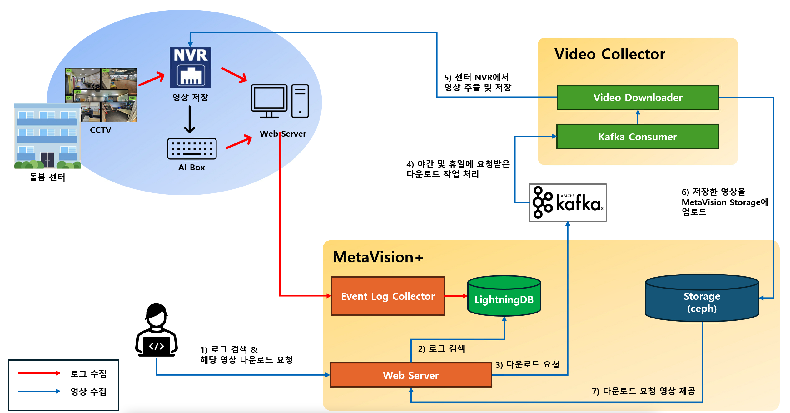

# 1. 발달장애 AI 돌봄센터

<b>MetaVision</b>의 <b>Data Agent</b>는 Vision AI가 적용된 서비스로부터 생성된 영상/이미지 데이터와 이로부터 추출된 메타데이터를 수집하고 관리하는 플랫폼입니다.

아래는 '발달장애 AI 돌봄센터'에 구축된 AI 서비스의 로그 및 영상 데이터를 수집하고 관리하는 플랫폼의 아키텍처입니다.

주요 기능은 아래와 같습니다.

- 돌봄센터에 설치된 AI Camera 또는 AI Box로 부터 생성되는 영상 및 메타데이터 저장
- 주기적으로 센터로부터 메타데이터를 수집하여 <b>MetaVision</b>의 <b>Data Agent</b>에 저장
- 수집한 메타데이터를 기반으로 사전 정의된 규칙에 따라 영상을 수집
- 사용자가 임의로 지정한 메타데이터에 대해서도 영상 저장
- 수집한 메타데이터와 영상은 ML Workflow를 수행하여 지정된 <b>Datasets</b>와 <b>Files</b>에 저장
- 저장된 영상에 대해 검색 서비스 제공

<b>< 발달장애 AI 돌봄센터 서비스 데이터 수집 아키텍처 ></b>

