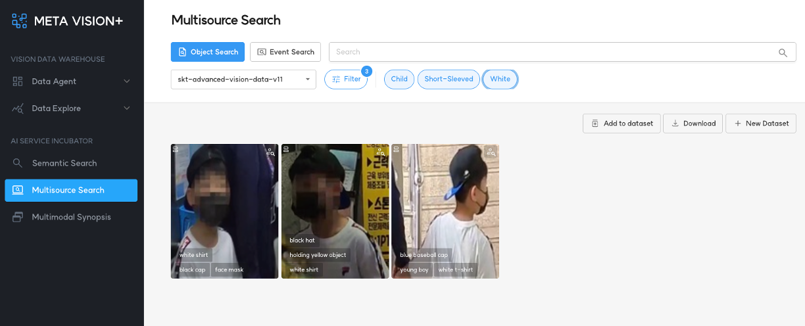
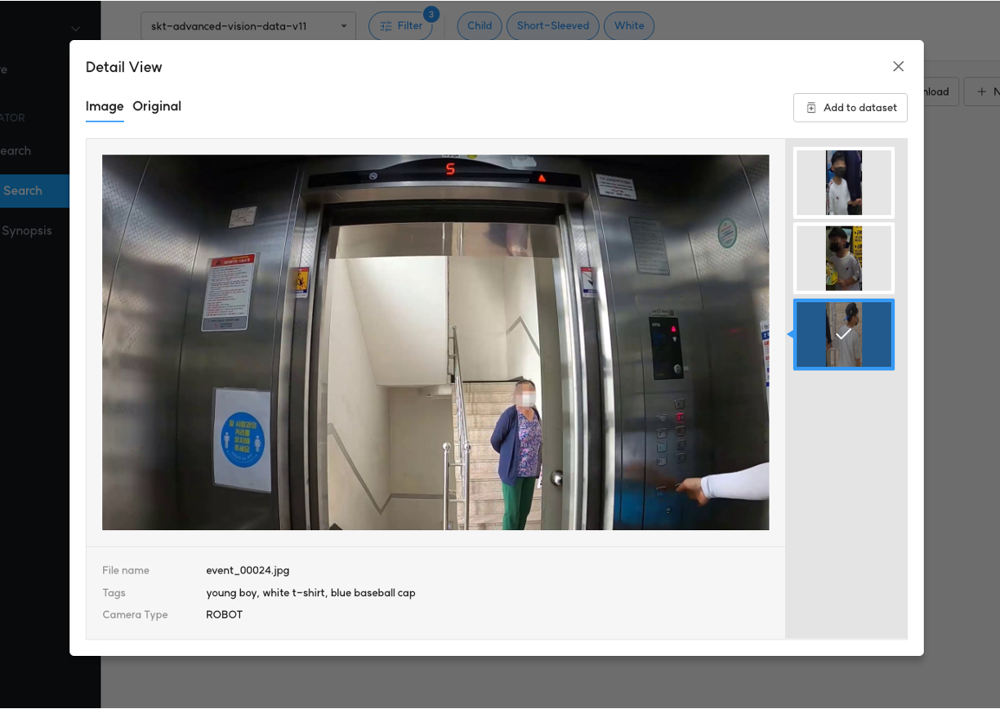
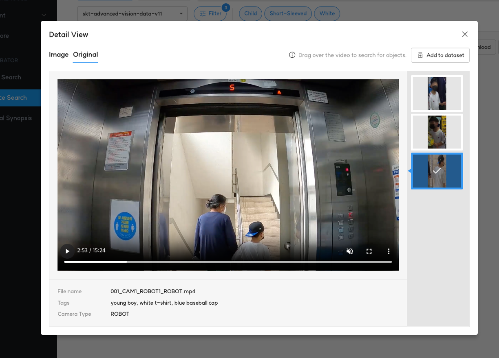

# 1. Object Search

<b>Object Search</b>는 AI가 인지한 사람 및 자동차의 특성을 기반으로 검색을 할 수 있는 플랫폼입니다.

아울러 Semantic Search 기능을 제공하여 검색을 더욱 정교하게 할 수 있습니다.

검색 가능한 객체의 특성은 다음과 같습니다.

- 사람
    - 성별
    - 나이
    - 소매 길이
    - 바지 길이
    - 머리 길이
    - 모자 착용 여부
    - 가방 소지 여부
    - 백팩 소지 여부
    - 상의 색상
    - 하의 색상
- 자동차
    - 색상
    - 차종
- 이륜차
    - 차종

<b>< Object Search 검색 옵션 ></b>

<b>< Object Search 검색 결과 ></b>

# 2. 검색 결과 상세 보기

검색 결과는 3 가지 형태로 제공됩니다.

- 객체가 포함된 영상 프레임 이미지

- 객체가 포함된 원본 영상

