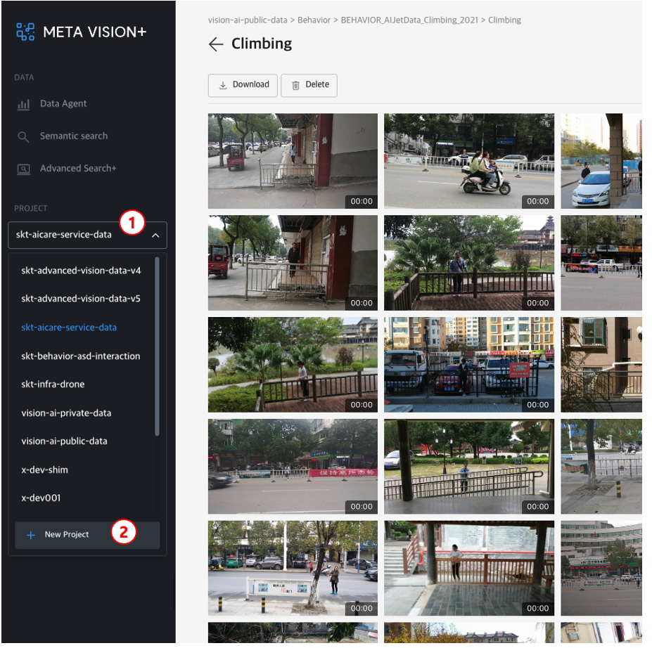

# Create Project

로그인 후 프로젝트 생성을 통해 Object Storage에 저장 공간과 메타데이터를 검색할 수 있는 Database를 생성할 수 있습니다.

좌측 'PROJECT' 메뉴를 통해 생성한 프로젝트 목록을 확인할 수 있고, 하단 New project 를 통해 신규 프로젝트를 생성할 수 있습니다.

<b>< 프로젝트 목록 및 생성 ></b>
