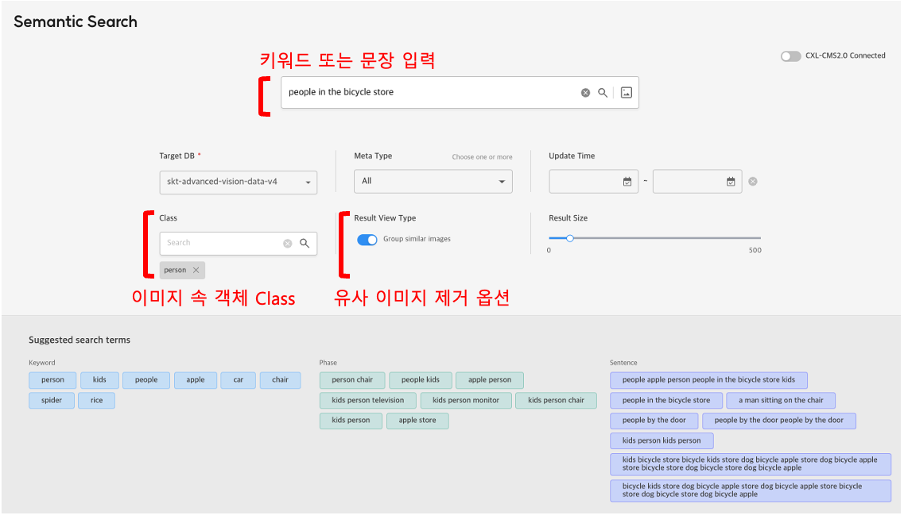
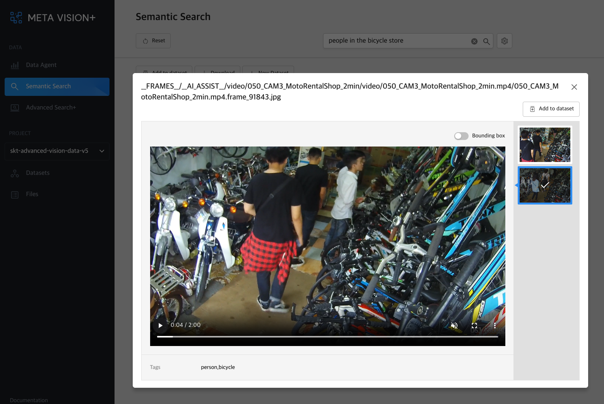

# 1. Semantic Search

<b>Semantic Search</b>에서 키워드 또는 문장을 입력받으면, 해당 텍스트와 의미가 유사한 이미지를 검색하여 제공합니다.

이렇게 검색된 이미지나 영상은 재생 또는 다운로드를 할 수 있으며, 데이터셋에 추가를 할 수 있습니다.

키워드/문장 외에 제공되는 검색 옵션은 다음과 같습니다.
- Target DB(저장소)
- 날짜
- 이미지 속 객체 Class
- 유사 이미지 제거 옵션
- 검색 결과 수(가장 유사한 k 개 반환)

<b>< Semantic Search 검색 화면 ></b>

<b>< Semantic Search 검색 결과 ></b>

<b>< 이미지/영상 상세 보기 ></b>
