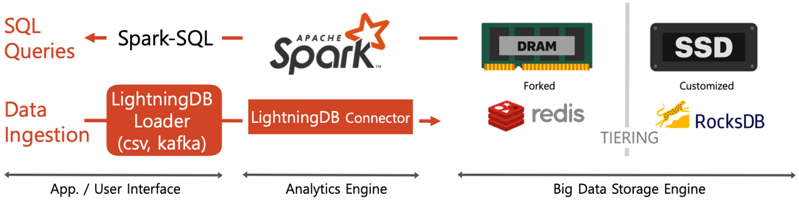

# 1. Main Features for Semantic Search

### 1) Contrastive Language-Image Pre-training(CLIP) Model

- ‘21 OpenAI, ‘자연어 지도를 통해 시각적 개념을 효율적으로 학습할 수 있는 모델’
- 이미지와 텍스트 사이의 관계를 같은 vector space에 표현할 수 있도록 학습
- OpenCLIP Model
    - LAION, 수십억 쌍의 데이터셋으로  CLIP model을 학습
- Procedure
    - Image Embedding 생성 및 DB 저장
    - Text Embedding 실시간 생성
    - Similarity Search(Image Embedding, Text Embedding)

<b>< Contrastive pre-training (from the CLIP blog post) ></b>

### 2) Vector Similarity Search
- Exact k-Nearest Neighbors(kNN)
    - 전체 데이터의 Embedding과 distance를 계산하여 가장 근접한 top k 개를 검색  데이터가 많아질수록 성능 저하
- Approximate Nearest Neighbor(ANN)
    - 유사도 인덱싱 생성 후, 가장 근접한 이웃을 단계적으로 탐색하면서 빠르게 top k 개를 검색
    - kNN 대비 상대적으로 정확도가 약간 낮지만, 성능이 더 뛰어남  대용량 데이터 검색에 적합

### 3) Lightning DB
- SKT에서 자체 개발한 인메모리 빅데이터 데이터베이스
- KNN/ANN Search를 DB에서 분산 및 가속 처리
- [https://docs.lightningdb.io](https://docs.lightningdb.io)

<b>< Lightning DB ></b>

# 2. Semantic Search

- <b>MetaVision</b>에 수집된 영상/이미지에 대한 image embedding 추출
- 사용자가 키워드 또는 문장을 입력하면 이에 대한 text embedding 추출
- Lightning DB에서 추출한 text embedding과 가장 유사한 image embedding 추출 (KNN/ANN Search 사용)

<b>< System Architecture of Semantic Search ></b>
