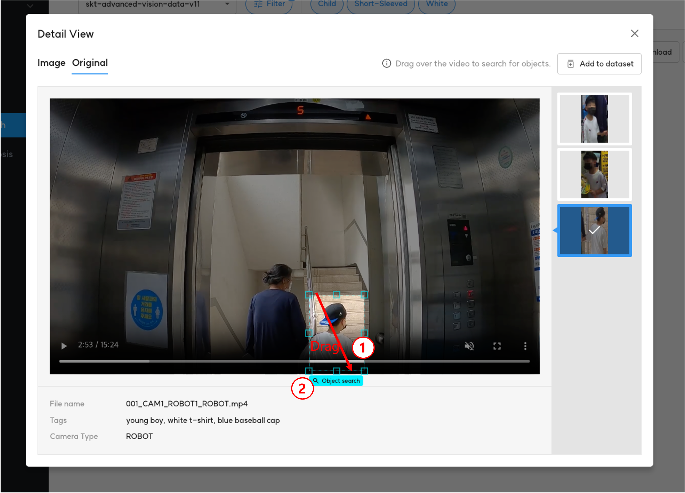

# 1. Similar Search

<b>Event Search</b>와 <b>Object Search</b>에서 제공되는 <b>상세 보기</b>의 <b>Original</b>에서는 원본 영상을 확인할 수 있습니다.

여기서 영상 재생 중 화면에 마우스를 드래그(Drag)하여 객체를 선택하면 이와 유사한 객체를 가진 이미지 또는 영상을 검색할 수 있습니다.

<b>< Similar Search 검색 화면 ></b>

<b>< Similar Search 검색 결과 ></b>

검색 결과로 나온 객체 이미지의 우측 상단 아이콘을 선택하면 이와 유사한 객체를 추가로 검색할 수 있습니다.

<b>< 추가 유사 객체 검색 결과 ></b>

객체 검색 결과 이미지를 선택하면 해당 객체가 있는 이미지와 원본 영상을 확인할 수 있습니다.

<b>< 검색한 객체의 상세 보기 ></b>
