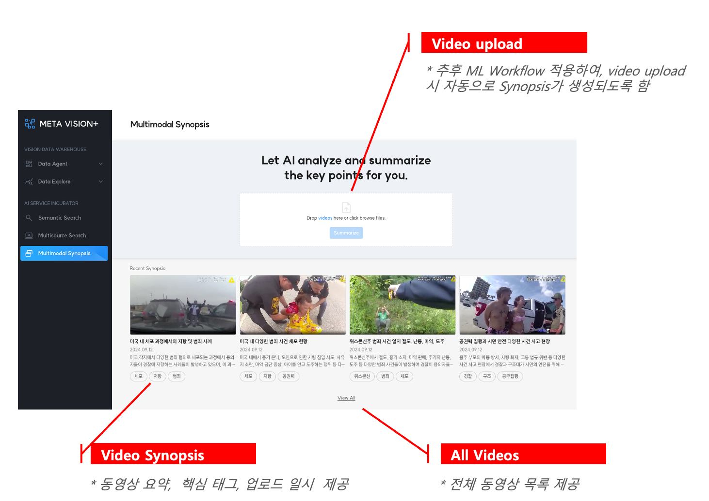

# Video Synopsis

Video Synopsis는 이미지를 분석하고 관리하던 기존 플랫폼에서, 비디오를 그대로 분석하고 요약하여 비디오에 대한 인사이트를 제공하고 검색 및 관리 효율성을 증대시키기 위한 서비스입니다.

### 1. 주요 기능

- <b>Video Synopsis List:</b> Video Synopsis 목록을 제공함
- <b>Visual Overview:</b> 비디오에 있는 주요 사건(이벤트)들을 시각적으로 한번에 확인할 수 있도록 함
- <b>Chapter Synopsis:</b> 비디오에 있는 모든 사건(이벤트)들에 대한 정보를 상세히 제공함
- <b>Multimodal Search:</b> 비디오에서 추출한 모든 정보(영상/시간/장소/키워드)를 활용하여 특정 장면이 포함된 사건(이벤트)를 검색할 수 있도록 함

### 2. Upload Video Files

 비디오 파일을 업로드하면, 내부 ML Pipeline을 통해 메타데이터 추출 및 분석이 진행됩니다.

 이 작업이 완료되면, 모든 결과물(요약 동영상 및 메타데이터)들은 스토리지 및 데이터베이스에 저장되고 하단 Video Synopsis 목록에 추가됩니다.

 

<b>< 비디오 업로드 및 최근 Video Synopsis 목록 제공 ></b>

### 3. Video Synopsis List

 메타데이터 추출 및 분석을 마쳐서 사용이 가능한 Video Synposis 목록을 제공합니다.

- 주요이벤트 장면 썸네일, 사건 요약, 일시, 태그 제공

 
 
<b>< 전체 Video Synopsis 목록 제공 ></b>

