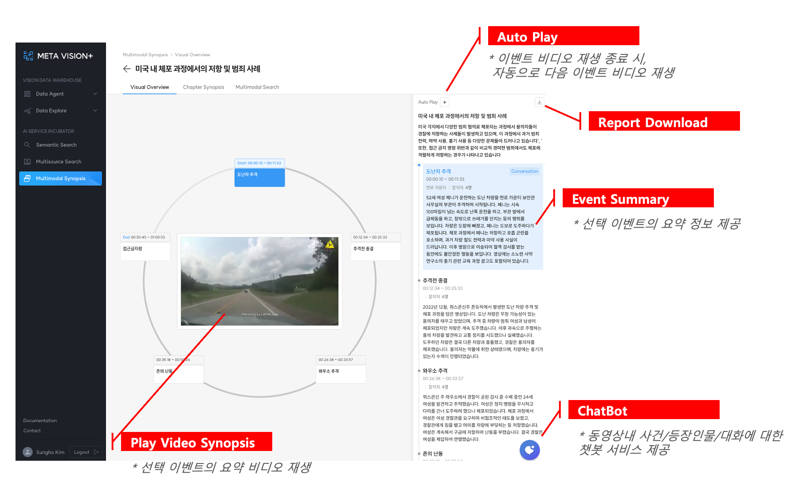
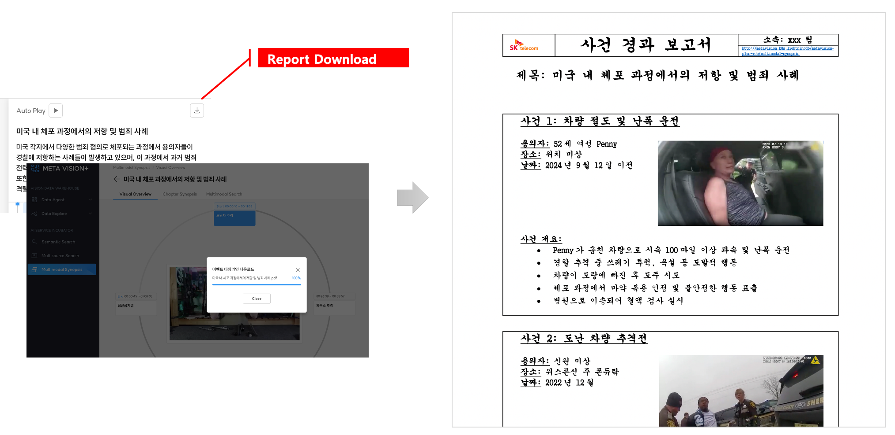
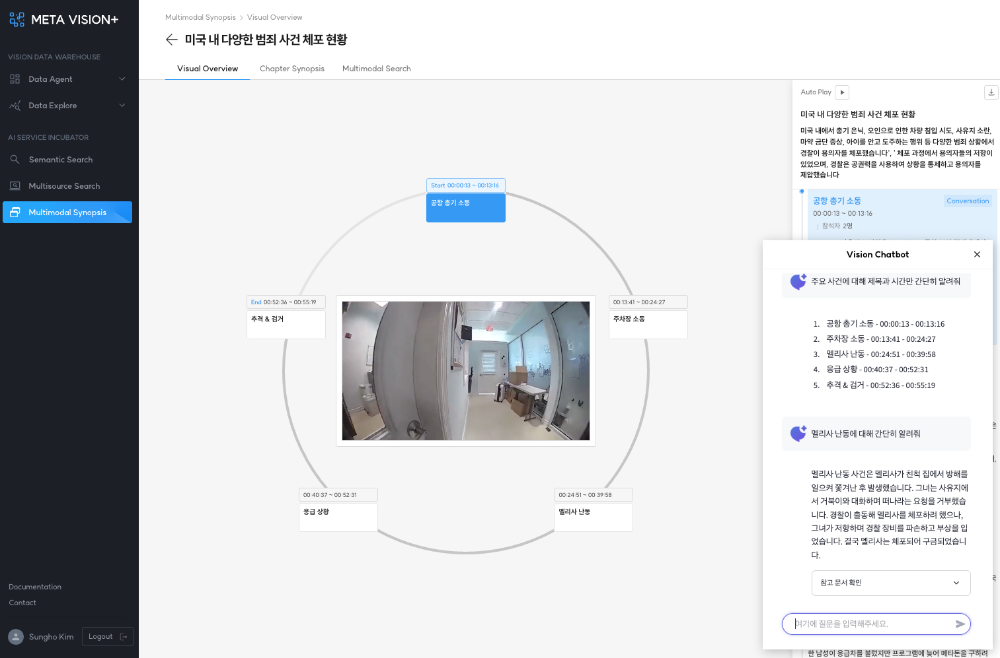

# Visual Overview

비디오 내 주요 이벤트(Starred Events) 목록을 제공합니다.

### 1. 주요 기능
- <b>Play Video Synopsis:</b> 선택 이벤트의 요약 비디오 재생
- <b>Auto Play:</b> 이벤트 비디오 재생 종료 시, 자동으로 다음 이벤트 비디오 재생
- <b>Report Download:</b> 요약 정보를 주어진 템플릿 형태로 레포트 발행
- <b>Event Summary:</b> 선택 이벤트의 요약 정보 제공
- <b>ChatBot:</b> 동영상내 사건/등장인물/대화에 대한 챗봇 서비스 제공

 

<b>< Visual Overview ></b>

### 2. Report Download

아래 요약 정보를 주어진 템플릿 형태로 레포트 발행

- 비디오 요약
- 이벤트별 인물/장소/일시 정보를 포함한 요약
- 대화록 및 대화별 주제 정보 요약
- 이벤트별 주요 장면(스크린샷) 제공

 

<b>< Report Download ></b>

### 3. ChatBot

RAG 시스템을 활용한 챗봇 서비스 제공

- 비디오별 레포트 파일을 활용한 RAG 시스템 및 챗봇 개발

 

<b>< ChatBot Service ></b>
